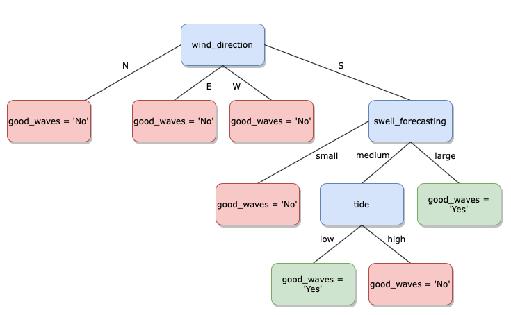

# ID3 algorithm scratch

Check out my medium article:

**

All the code is in a public repository at the link below:

https://github.com/bergr7/ID3_From_Scratch

## Table of Contents
1. Installation
2. Project Motivation
3. File Descriptions
4. Results
5. Licensing, Authors, Acknowledgements
6. MIT License

## Installation

- Libraries included in Anaconda distribution of Python 3.8.
- Packages versions:

    - pandas Version: 1.0.1
    - numpy Version: 1.19.2

## Project Motivation

I am interested in understanding how to code a Decision Tree algorithm from
scratch.

Code created for writing a medium post about coding the ID3 algorithm to build a Decision Tree Classifier
from scratch.

## Results

Python module with the implementation of the ID3 algorithm.

Resulting Decision tree:

## Licensing, Authors and Acknowledgements

I would like to give credit to:

- Professors of the MSc in Machine Learning, Deep Learning and AI by Big Data
International Campus and UCAM

## MIT License

Copyright 2020 Bernardo Garcia

Permission is hereby granted, free of charge, to any person obtaining a copy of this software and associated documentation files (the "Software"), to deal in the Software without restriction, including without limitation the rights to use, copy, modify, merge, publish, distribute, sublicense, and/or sell copies of the Software, and to permit persons to whom the Software is furnished to do so, subject to the following conditions:

The above copyright notice and this permission notice shall be included in all copies or substantial portions of the Software.

THE SOFTWARE IS PROVIDED "AS IS", WITHOUT WARRANTY OF ANY KIND, EXPRESS OR IMPLIED, INCLUDING BUT NOT LIMITED TO THE WARRANTIES OF MERCHANTABILITY, FITNESS FOR A PARTICULAR PURPOSE AND NONINFRINGEMENT. IN NO EVENT SHALL THE AUTHORS OR COPYRIGHT HOLDERS BE LIABLE FOR ANY CLAIM, DAMAGES OR OTHER LIABILITY, WHETHER IN AN ACTION OF CONTRACT, TORT OR OTHERWISE, ARISING FROM, OUT OF OR IN CONNECTION WITH THE SOFTWARE OR THE USE OR OTHER DEALINGS IN THE SOFTWARE.
